# Структура должностей в IT-компаниях и стартапах

## Введение

Этот документ описывает типичную организационную структуру IT-компаний и стартапов, включая должности, иерархию и зоны ответственности. Информация поможет понять собственные компетенции и правильно позиционироваться на рынке труда.

## Организационная структура компании

```mermaid
graph TD
    A[CEO - Chief Executive Officer] --> B[COO - Operations]
    A --> C[CFO - Finance]
    A --> D[CRO - Revenue & Sales]
    A --> E[CPO - Product]
    A --> F[CTO - Technology]
    
    B --> B1[HR & Recruiting]
    B --> B2[Office Management]
    B --> B3[Legal]
    
    C --> C1[Accounting]
    C --> C2[Financial Analysis]
    C --> C3[Procurement]
    
    D --> D1[Marketing]
    D --> D2[Sales]
    D --> D3[Customer Success]
    
    D1 --> D1a[Content Management]
    D1 --> D1b[SMM]
    D1 --> D1c[Performance Marketing]
    
    D2 --> D2a[Account Management]
    D2 --> D2b[Sales Management]
    
    D3 --> D3a[Customer Success Management]
    D3 --> D3b[Support - Tier 1/2]
    
    E --> E1[Product Management]
    E --> E2[Product Ownership]
    E --> E3[Business Analysis]
    E --> E4[UX/UI Design]
    
    F --> F1[Engineering Management]
    F --> F2[Tech Leadership]
    F --> F3[Development Teams]
    F --> F4[QA & Testing]
    F --> F5[DevOps & SRE]
    F --> F6[Information Security]
    
    F3 --> F3a[Frontend Development]
    F3 --> F3b[Backend Development]
    F3 --> F3c[Mobile Development]
    
    F3a --> F3a1[Intern]
    F3a --> F3a2[Junior]
    F3a --> F3a3[Middle]
    F3a --> F3a4[Senior]
    F3a --> F3a5[Lead]
    
    F3b --> F3b1[Intern]
    F3b --> F3b2[Junior]
    F3b --> F3b3[Middle]
    F3b --> F3b4[Senior]
    F3b --> F3b5[Lead]
    
    F3c --> F3c1[Junior]
    F3c --> F3c2[Middle]
    F3c --> F3c3[Senior]
    
    F4 --> F4a[Manual QA]
    F4 --> F4b[QA Automation]
    
    F5 --> F5a[Junior DevOps]
    F5 --> F5b[Middle DevOps]
    F5 --> F5c[Senior DevOps]
    
    F6 --> F6a[CISO]
    F6 --> F6b[Security Engineer]
    F6 --> F6c[Pentester]
    F6 --> F6d[SOC Analyst]
    
    G[Board of Directors] --> A
    H[Investors] --> A
```

## Детальное описание должностей

### 🔝 Топ-менеджмент (C-level)

- **CEO (Chief Executive Officer)** — генеральный директор, стратегия компании, общее руководство
- **CTO (Chief Technology Officer)** — технический директор, технологии и команда разработки
- **CPO (Chief Product Officer)** — главный по продукту (в крупных компаниях)
- **CFO (Chief Financial Officer)** — финансы, инвестиции, бюджеты
- **COO (Chief Operating Officer)** — операционка, процессы, эффективность
- **CRO (Chief Revenue Officer)** — выручка, продажи, маркетинг

### 👨‍💻 Разработчики по грейдам

**Фронтенд / Бэкенд / Мобильные / DevOps** — стандартная градация:

- **Intern / Стажёр** — обучение, мелкие задачи
- **Junior** — работа с поддержкой ментора
- **Middle** — самостоятельная работа, закрытие задач без помощи
- **Senior** — архитектура, сложные фичи, менторинг
- **Lead / Tech Lead** — техническое лидерство команды
- **Principal Engineer / Staff Engineer** — эксперты-гуру, направление технологий
- **Engineering Manager** — больше менеджмент, чем код

### 🔐 Информационная безопасность

- **Security Analyst / SOC Analyst** — мониторинг инцидентов, анализ логов
- **Pentester / Ethical Hacker** — тестирование системы на уязвимости
- **AppSec Engineer** — безопасность кода и приложений
- **Security Engineer** — настройка систем защиты (firewalls, SIEM)
- **CISO (Chief Information Security Officer)** — главный по безопасности

### 📦 Продакт/Проект менеджмент

**Ключевые различия:**

- **Product Manager (PM)** — отвечает за продукт: что делаем, для кого, зачем
  - Думает о пользователях, рынке, бизнес-ценности
  - Пишет product vision, фичи, приоритизирует задачи
  
- **Product Owner (PO)** — термин из Scrum
  - Прокси между Product Manager и командой
  - В маленьких компаниях PM и PO — один человек
  
- **Project Manager** — управляет проектом: сроки, бюджеты, планы
  - Контролирует дедлайны, не вникает в суть продукта
  - Управляет задачами в Jira, Trello
  
- **Program Manager** — управляет несколькими проектами одновременно

### 💬 Customer Success / Account Management

- **Customer Success Manager (CSM)** — помогает клиентам эффективно использовать продукт
  - Фокус на удержании клиентов
  - Не техническая поддержка, а стратегическая работа с клиентами
  
- **Account Manager** — больше про продажи и продление контрактов
  - Апселлы, кросс-продажи

## Детальные требования к должностям

### 📋 Product Manager (PM)

#### Основные обязанности:
- **Стратегия продукта** — определение vision, roadmap, целей продукта
- **Исследование рынка** — анализ конкурентов, трендов, потребностей пользователей
- **Управление бэклогом** — приоритизация задач, написание user stories
- **Аналитика** — отслеживание метрик, A/B тестирование, принятие решений на основе данных
- **Коммуникация** — взаимодействие с командой разработки, стейкхолдерами, клиентами
- **Планирование релизов** — координация с командой, определение scope

#### Требуемые навыки:
- **Hard Skills:**
  - Анализ данных (SQL, Excel, Google Analytics, Mixpanel)
  - Инструменты управления продуктом (Jira, Confluence, Figma, Miro)
  - Методологии разработки (Agile, Scrum, Kanban)
  - Базовые знания UX/UI принципов
  
- **Soft Skills:**
  - Лидерство и влияние без прямого подчинения
  - Критическое мышление и принятие решений
  - Коммуникация и презентация
  - Эмпатия к пользователям
  - Управление конфликтами и приоритизация

#### Опыт и образование:
- Обычно требуется 3-5+ лет опыта в IT или смежных областях
- Образование: бизнес, экономика, IT, психология, дизайн
- Опыт работы с продуктами B2B/B2C в зависимости от компании

### 🎯 Product Owner (PO)

#### Основные обязанности:
- **Управление бэклогом** — детализация user stories, acceptance criteria
- **Спринт планирование** — участие в sprint planning, refinement
- **Принятие решений** — approve/reject готовые задачи
- **Коммуникация с командой** — ежедневное взаимодействие с разработчиками
- **Уточнение требований** — ответы на вопросы команды в процессе разработки
- **Приемка результатов** — проверка соответствия требованиям

#### Требуемые навыки:
- **Hard Skills:**
  - Детальное знание продукта и бизнес-процессов
  - Написание четких user stories и acceptance criteria
  - Работа с Jira, Confluence, другими инструментами команды
  - Понимание технических ограничений и возможностей
  
- **Soft Skills:**
  - Детальность и внимание к мелочам
  - Быстрое принятие решений
  - Эффективная коммуникация с технической командой
  - Умение объяснять бизнес-требования простым языком

#### Опыт и образование:
- Часто требуется 2-3+ года опыта в роли PO или PM
- Сертификация Scrum Product Owner (PSPO) — преимущество
- Техническое образование или опыт работы с IT-продуктами

### 🎯 Customer Success Manager (CSM)

#### Основные обязанности:
- **Онбординг клиентов** — помощь в запуске и настройке продукта
- **Обучение пользователей** — проведение демо, вебинаров, создание обучающих материалов
- **Мониторинг использования** — отслеживание активности, выявление проблем
- **Проактивная поддержка** — предупреждение проблем до их возникновения
- **Увеличение ценности** — помощь клиентам получить максимум от продукта
- **Удержание клиентов** — снижение churn rate, продление контрактов
- **Сбор обратной связи** — проведение NPS опросов, интервью с клиентами

#### Требуемые навыки:
- **Hard Skills:**
  - CRM системы (Salesforce, HubSpot, Pipedrive)
  - Инструменты аналитики (Mixpanel, Amplitude, Google Analytics)
  - Платформы для вебинаров (Zoom, Teams, WebinarJam)
  - Базовые знания продукта и технических возможностей
  
- **Soft Skills:**
  - Эмпатия и понимание потребностей клиентов
  - Отличные коммуникативные навыки
  - Решение проблем и критическое мышление
  - Тайм-менеджмент и приоритизация
  - Умение работать с возражениями

#### Опыт и образование:
- Обычно требуется 2-4 года опыта в продажах, поддержке или менеджменте
- Образование: бизнес, маркетинг, психология, коммуникации
- Опыт работы с B2B клиентами — преимущество

### 📊 Project Manager (PM)

#### Основные обязанности:
- **Планирование проекта** — создание планов, определение scope, timeline, бюджета
- **Управление командой** — координация работы разработчиков, дизайнеров, тестировщиков
- **Управление рисками** — выявление, анализ и минимизация проектных рисков
- **Контроль качества** — обеспечение соответствия результата требованиям
- **Коммуникация** — регулярные отчеты стейкхолдерам, статус-встречи
- **Управление изменениями** — обработка change requests, корректировка планов
- **Закрытие проекта** — финализация, документация, извлечение уроков

#### Требуемые навыки:
- **Hard Skills:**
  - Инструменты управления проектами (Jira, Asana, Monday, MS Project)
  - Методологии (Waterfall, Agile, Scrum, Kanban, PRINCE2)
  - Управление ресурсами и бюджетами
  - Анализ данных и отчетность
  
- **Soft Skills:**
  - Лидерство и мотивация команды
  - Управление конфликтами и стрессом
  - Переговоры и влияние
  - Планирование и организация
  - Адаптивность к изменениям

#### Опыт и образование:
- Обычно требуется 3-5+ лет опыта в управлении проектами
- Сертификации: PMP, PRINCE2, CSM, PSM — преимущество
- Образование: менеджмент, IT, инженерия, бизнес

### ⚡ Execution Project Manager (EPM)

#### Основные обязанности:
- **Исполнение проектов** — фокус на реализации, а не планировании
- **Операционное управление** — ежедневный контроль выполнения задач
- **Управление ресурсами** — распределение людей, времени, инструментов
- **Мониторинг прогресса** — отслеживание KPI, метрик выполнения
- **Решение операционных проблем** — быстрая реакция на блокеры
- **Координация команд** — синхронизация между разными отделами
- **Отчетность** — регулярные статус-обновления для стейкхолдеров

#### Требуемые навыки:
- **Hard Skills:**
  - Инструменты управления проектами (Jira, Asana, Monday, MS Project)
  - Методологии Agile/Scrum (Kanban, Scrumban, Lean)
  - Управление ресурсами и capacity planning
  - Анализ данных и создание дашбордов
  
- **Soft Skills:**
  - Быстрое принятие решений
  - Управление приоритетами в условиях ограниченного времени
  - Эффективная коммуникация в кризисных ситуациях
  - Мотивация команды под давлением
  - Адаптивность к изменениям

#### Опыт и образование:
- Обычно требуется 2-4 года опыта в управлении проектами
- Сертификации: CSM, PSM, PMI-ACP — преимущество
- Образование: менеджмент, IT, инженерия
- Опыт работы в fast-paced среде

### 🏭 Commodity Project Manager (CPM)

#### Основные обязанности:
- **Управление поставками** — координация с поставщиками и подрядчиками
- **Планирование закупок** — определение потребностей в материалах и услугах
- **Управление контрактами** — контроль выполнения условий договоров
- **Оптимизация затрат** — поиск способов снижения стоимости закупок
- **Управление качеством** — контроль качества поставляемых товаров/услуг
- **Логистика** — координация доставки, складирования, распределения
- **Управление рисками** — минимизация рисков срыва поставок

#### Требуемые навыки:
- **Hard Skills:**
  - Инструменты управления закупками (SAP, Oracle, Coupa)
  - Анализ рынка поставщиков и цен
  - Управление контрактами и юридическая документация
  - ERP системы и управление складскими запасами
  - Анализ данных и отчетность по закупкам
  
- **Soft Skills:**
  - Переговоры с поставщиками
  - Управление отношениями с подрядчиками
  - Аналитическое мышление
  - Планирование и прогнозирование
  - Решение проблем в цепочке поставок

#### Опыт и образование:
- Обычно требуется 3-5+ лет опыта в закупках, логистике или управлении проектами
- Сертификации: CPSM, CIPS, PMP — преимущество
- Образование: логистика, менеджмент, экономика, инженерия
- Опыт работы в производственных или торговых компаниях

### 🔄 Сравнение ролей в проектах

| Аспект | Product Manager | Product Owner | Project Manager | Execution PM | Commodity PM |
|--------|----------------|---------------|-----------------|--------------|--------------|
| **Фокус** | Что делаем, для кого | Как делаем, детали | Когда делаем, ресурсы | Как быстро делаем | Что покупаем, у кого |
| **Временной горизонт** | Кварталы, годы | Спринты, недели | Месяцы, кварталы | Дни, недели | Месяцы, кварталы |
| **Основная цель** | Бизнес-ценность | Качество продукта | Своевременность | Скорость выполнения | Оптимизация затрат |
| **Метрики** | Бизнес-показатели | Скорость команды | Сроки, бюджет, качество | Velocity, throughput | Стоимость, качество, сроки поставок |
| **Стейкхолдеры** | Клиенты, инвесторы | Команда, менеджеры | Спонсоры, команда | Команда, менеджеры | Поставщики, логистика, финансы |

**CPM** специализируется на управлении закупками и поставками, что критично для производственных и торговых компаний, где стоимость материалов составляет значительную часть бюджета проекта.
