# Модели продаж: полная классификация

> **Основная идея:** Разные продукты и услуги требуют принципиально разных подходов к продажам. Где-то продукт продаёт себя сам, где-то нужен персональный подход, а где-то — целый отдел продаж.

```mermaid
graph LR
    subgraph Simple["Простые модели"]
        A["Self-service<br/>(Самообслуживание)"]
        B["Marketplace-driven<br/>(Маркетплейсы)"]
        C["Transactional<br/>(Транзакционные)"]
    end
    
    subgraph Hybrid["Гибридные модели"]
        D["Founder-led<br/>(Руками фаундера)"]
        E["High-touch<br/>(Персональное сопровождение)"]
        F["Sales-assisted<br/>(С поддержкой продаж)"]
    end
    
    subgraph Complex["Сложные модели"]
        G["Sales-driven<br/>(Отдел продаж)"]
        H["Channel sales<br/>(Партнёрские)"]
        I["Enterprise consultative<br/>(Консультативные)"]
        J["Multi-stakeholder<br/>(Множество ЛПР)"]
    end
    
    Simple --> Hybrid
    Hybrid --> Complex
    
    style Simple color:#20c997
    style Hybrid color:#6f42c1
    style Complex color:#fd7e14
```

## Ключевые факторы выбора модели

Выбор модели продаж зависит от **трёх основных параметров**:

1. **Средний чек** — чем выше, тем больше нужен человеческий контакт
2. **Цикл сделки** — чем длиннее путь к покупке, тем важнее "вести" клиента  
3. **Очевидность ценности** — если продукт понятен сам по себе → маркетинг, если сложный → продажи

---

# Простые модели

## 1. Self-service (продукт продаёт себя)

**Ключ:** Пользователь сам принимает решение через маркетинг и удобный продуктовый флоу.

**Где встречается:** SaaS с низким чеком, e-commerce, подписки, приложения

**Признаки:**
- Низкий чек
- Ценность очевидна, не требует объяснений
- Скалирование = маркетинг + продукт

**Примеры:** Notion, Spotify, Zoom (freemium), Яндекс.Музыка (подписка), VK Видео (подписка), Тинькофф Банк (открытие карт онлайн), Ozon (товары), Wildberries (товары)

---

## 2. Marketplace-driven

**Ключ:** Продукт "встроен" в чужую платформу/маркетплейс.

**Где встречается:** SaaS-виджеты, плагины, товары в e-commerce

**Признаки:**
- Зависимость от правил площадки
- Нет отдела продаж в классическом виде

**Примеры:** Shopify apps, AWS Marketplace, 1C-Битрикс (модули и компоненты), RuStore (мобильные приложения), VK Mini Apps (мини-приложения)

---

## 3. Transactional sales

**Ключ:** Массовые, быстрые сделки с простым продуктом, но всё же с участием продавца.

**Где встречается:** SMB (малый и средний бизнес), страхование, B2C-услуги

**Признаки:**
- Средний чек небольшой
- Цикл сделки короткий (дни/недели)
- Важен объём сделок

**Примеры:** Страховые агенты, телеком-операторы, МТС (тарифные планы), Билайн (услуги связи), Ренессанс Страхование (полисы ОСАГО), Тинькофф Страхование (автострахование)

---

# Гибридные модели

## 4. Founder-led sales (продажи руками фаундера)

**Ключ:** Доверие строится напрямую через личный контакт и экспертность.

**Где встречается:** Ранние стартапы, новые рынки, кастомные продукты

**Признаки:**
- Лидов мало, но каждый дорог
- Продаёт экспертность фаундера, а не просто продукт
- Часто без маркетинга — через личные связи, рекомендации

**Примеры:** Консалтинг, первые Enterprise-договоры стартапа, Rocket Data (разработка мобильных приложений), Elbuz (создание интернет-магазинов), Unisender (email-маркетинг для крупных клиентов)

---

## 5. High-touch onboarding / Customer Success-driven

**Ключ:** Продукт почти self-service, но нужен человек для "дотягивания клиента до успеха".

**Где встречается:** Сложные SaaS, платформы, где важно удержание

**Признаки:**
- Средний чек выше
- Усложнённый флоу, требующий помощи
- Главная роль — удержание и апсейлы

**Примеры:** HubSpot, Intercom, CRM-системы, amoCRM (внедрение и настройка), Битрикс24 (корпоративный портал), МойСклад (автоматизация учёта)

---

## 6. Sales-assisted (product-led sales)

**Ключ:** Продукт сам генерит лиды (freemium/триал), но для Enterprise включается сейлз.

**Где встречается:** Компании с широкой линейкой тарифов

**Признаки:**
- Малый бизнес заходит сам
- Крупные клиенты требуют продажника

**Примеры:** Slack, Zoom, GitHub, Яндекс.Облако (корпоративные тарифы), VK WorkSpace (для крупных команд), Контур.Эльба (бухгалтерия для ИП и ООО)

---

# Сложные модели

## 7. Классический sales-driven

**Ключ:** Машина из SDR → AE → CSM.

**Где встречается:** B2B с высоким чеком и длинным циклом сделки

**Признаки:**
- Лиды дорогие, цикл сделки месяцы или годы
- Сильный отдел продаж — костяк бизнеса
- Маркетинг играет вспомогательную роль (brand, lead gen)

**Примеры:** Oracle, SAP, Salesforce, 1C:Предприятие (корпоративные лицензии), СБИС (электронный документооборот), Террасофт (CRM-платформа)

**Роли в отделе продаж:**
- **SDR (Sales Development Representative)** — менеджер по развитию продаж, "охотники за встречами", ищут и квалифицируют лиды
- **AE (Account Executive)** — менеджер по работе с клиентами, ведут переговоры и закрывают сделки
- **CSM (Customer Success Manager)** — менеджер по успеху клиентов, ведут клиента, удерживают и помогают апселлить

---

## 8. Channel sales (партнёрские продажи)

**Ключ:** Продаёшь не напрямую, а через партнёров/дистрибьюторов.

**Где встречается:** Софт, оборудование, консалтинг

**Признаки:**
- Выход на рынки через локальных игроков
- Чек может быть любым, часто Enterprise

**Примеры:** Microsoft, Cisco, Ростелеком (корпоративные решения через партнёров), Лаборатория Касперского (антивирусы через дилерскую сеть), Яндекс (реклама через агентства)

---

## 9. Enterprise consultative sales

**Ключ:** Продажа идёт через "консалтинг" и проработку бизнес-кейсов клиента.

**Где встречается:** Big4, дорогие консалтинг/интеграции, кастомный софт

**Признаки:**
- Цикл сделки длинный, может быть >1 года
- Нужен консалтинг, presale-инженеры, пилоты

**Примеры:** Accenture, Deloitte, Palantir, КРОК (ИТ-консалтинг и интеграция), Техносерв (цифровая трансформация), АйТеко (комплексная автоматизация бизнеса)

---

## 10. Complex/multi-stakeholder sales

**Ключ:** Продукт покупает не один человек, а группа (IT-директор, финдиректор, CEO).

**Где встречается:** B2B SaaS, инфраструктура, госзакупки

**Признаки:**
- Нужно убеждать разных людей с разными интересами
- Важны тендеры, пилоты, демонстрации

**Примеры:** Cisco, Workday, Сбер (корпоративные банковские продукты), Газпром нефть (ИТ-решения для нефтегазовой отрасли), РЖД (цифровые платформы для железнодорожной отрасли)

---

## Упрощённая схема

Если упростить до основ:

- **Self-service** — дешёвый, массовый, короткий цикл
- **Sales-driven** — дорогой, сложный, длинный цикл
- **Всё остальное** — переходные или гибридные модели между ними

## Гибридные модели

Часто компании проходят все стадии:
1. Сначала фаундер продаёт руками
2. Потом появляется отдел продаж
3. Часть продукта "упрощается" и начинает продаваться сама

---

## Диаграммы

Диаграммы представляют карту моделей продаж в двумерном пространстве:

- **Ось X (горизонтальная)** — средний чек сделки (от низкого слева до очень высокого справа)
- **Ось Y (вертикальная)** — длительность цикла сделки (от короткого внизу до очень длинного вверху)

**Как распределены модели:**

- **Левый нижний угол** (низкий чек + короткий цикл): Self-service, Marketplace-driven, Transactional sales
- **Центр** (средний чек + средний цикл): Founder-led sales, High-touch onboarding, Sales-assisted  
- **Правый верхний угол** (высокий чек + длинный цикл): Классический sales-driven, Channel sales, Complex/multi-stakeholder sales
- **Крайний правый верх** (очень высокий чек + очень длинный цикл): Enterprise consultative sales

**Главный инсайт:** Чем дешевле и проще продукт → тем больше самообслуживание. Чем дороже и сложнее → тем сильнее нужна команда продаж.

## Обновлённые диаграммы

Новые версии диаграмм с улучшенным позиционированием и цветовой группировкой:

**Английская версия:**

**Русская версия:**
